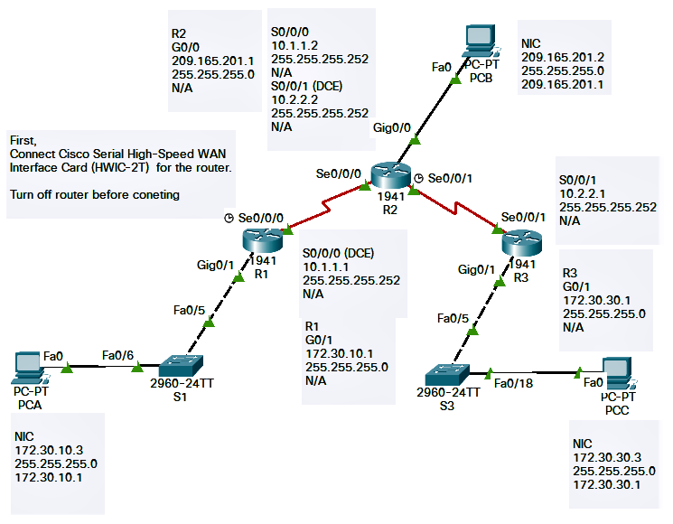

# Additional interfaces
1. [Connecting Cisco Serial High-Speed WAN Interface Cards](https://www.cisco.com/c/en/us/td/docs/routers/access/interfaces/ic/hardware/installation/guide/1_2T_2AS_HWIC.html) to connect

