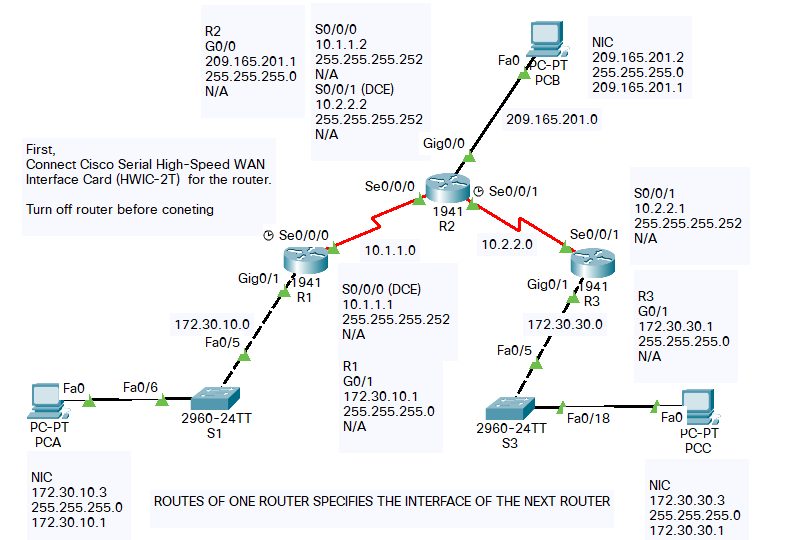

# Additional interfaces
1. [Connecting Cisco Serial High-Speed WAN Interface Cards](https://www.cisco.com/c/en/us/td/docs/routers/access/interfaces/ic/hardware/installation/guide/1_2T_2AS_HWIC.html) to connect



# Configure RIP on a router

> Not to advertise a network:: do not give the command R2(config-router)#network x.x.x.x

```

R1# config t
R1(config)# router rip
R1(config-router)# version 2
R1(config-router)# passive-interface g0/1 // updates will not be forwarded to passive interfaces
R1(config-router)# network 172.30.0.0
R1(config-router)# network 10.0.0.0

```
### Verify that RIPv2 is running on the routers
```
R1# show ip protocols

---

R1#debug ip rip
RIP protocol debugging is on
R1#undebug all
All possible debugging has been turned off

---

R1#show run
```

### To view routing table
```
R2# show ip route
```

### Disable automatic summarization.
The no auto-summary command is used to turn off automatic summarization in RIPv2. Disable auto summarization on all routers. The routers will no longer summarize routes at major classful network boundaries. R1 is shown here as an example.
```
R1(config)# router rip
R1(config-router)# no auto-summary
R1# clear ip route *
```

### Configure and redistribute a default route for Internet access

From R2, create a static route to network 0.0.0.0 0.0.0.0, using the ip route command. This forwards any traffic with an unknown destination address to PC-B at 209.165.201.2, simulating the Internet by setting a Gateway of Last Resort on router R2.

#### A Gateway of Last Resort or Default gateway is a route used by the router when no other known route exists to transmit the IP packet. Known routes are present in the routing table. Hence, any route not known by the routing table is forwarded to the default route.

```
R2(config)# ip route 0.0.0.0 0.0.0.0 209.165.201.2
//R2 will advertise a route to the other routers if the default-information originate command is added to its RIP configuration.
R2(config)# router rip
R2(config-router)# default-information originate

R1# show ip route
<Output omitted> 
Gateway of last resort is 10.1.1.2 to network 0.0.0.0
R* 0.0.0.0/0 [120/1] via 10.1.1.2, 00:00:13, Serial0/0/0
```
