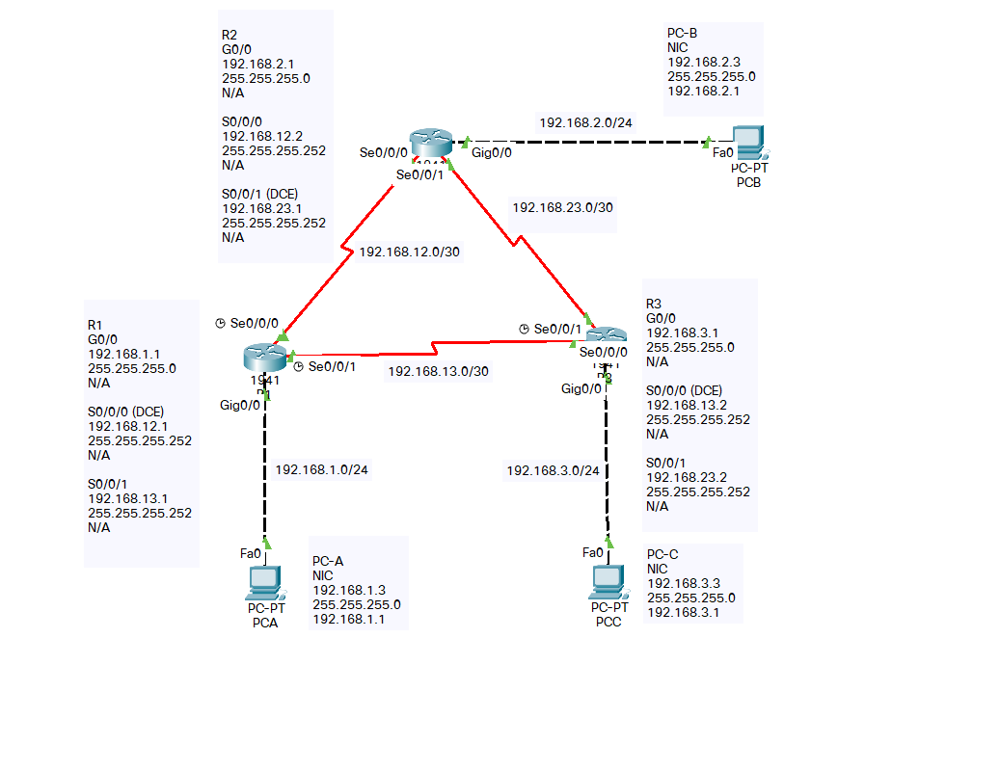

###	Use the router ospf command in global configuration mode to enable OSPF on R1.
```
R1(config)# router ospf 1
Note: The OSPF process id is kept locally and has no meaning to other routers on the network.
```
### Enabling OSPF on Interfaces
Use the network command to specify which interface(s) participate in the OSPFv2 area.
```
(config)# router ospf x
(config-router)# network x.x.x.x wildcard_mask area area-id
```

### The network Command: Two ways to use the network command
* Advertise the particular network, calculating the wildcard mask
* Advertise the IP address on the router interface with a 0.0.0.0 wildcard mask (EASIER)

### To verify that each router lists the other routers in the network as neighbors.
```
R1# show ip ospf neighbor

Neighbor ID     Pri   State           Dead Time   Address         Interface
192.168.23.2      0   FULL/  -        00:00:33    192.168.13.2    Serial0/0/1
192.168.23.1      0   FULL/  -        00:00:30    192.168.12.2    Serial0/0/0

```

### To verify that all networks display in the routing table on all routers
```
R3#show ip route
Codes: L - local, C - connected, S - static, R - RIP, M - mobile, B - BGP
       D - EIGRP, EX - EIGRP external, O - OSPF, IA - OSPF inter area
       N1 - OSPF NSSA external type 1, N2 - OSPF NSSA external type 2
       E1 - OSPF external type 1, E2 - OSPF external type 2, E - EGP
       i - IS-IS, L1 - IS-IS level-1, L2 - IS-IS level-2, ia - IS-IS inter area
       * - candidate default, U - per-user static route, o - ODR
       P - periodic downloaded static route

Gateway of last resort is not set

O    192.168.1.0/24 [110/65] via 192.168.13.1, 00:28:57, Serial0/0/0
O    192.168.2.0/24 [110/65] via 192.168.23.1, 00:28:25, Serial0/0/1
     192.168.3.0/24 is variably subnetted, 2 subnets, 2 masks
C       192.168.3.0/24 is directly connected, GigabitEthernet0/0
L       192.168.3.1/32 is directly connected, GigabitEthernet0/0
     192.168.12.0/30 is subnetted, 1 subnets
O       192.168.12.0/30 [110/128] via 192.168.13.1, 00:28:25, Serial0/0/0
                        [110/128] via 192.168.23.1, 00:28:25, Serial0/0/1
     192.168.13.0/24 is variably subnetted, 2 subnets, 2 masks
C       192.168.13.0/30 is directly connected, Serial0/0/0
L       192.168.13.2/32 is directly connected, Serial0/0/0
     192.168.23.0/24 is variably subnetted, 2 subnets, 2 masks
C       192.168.23.0/30 is directly connected, Serial0/0/1
L       192.168.23.2/32 is directly connected, Serial0/0/1
```

### To only see the OSPF routes in the routing table?
```
R3#show ip route ospf
O    192.168.1.0 [110/65] via 192.168.13.1, 00:03:56, Serial0/0/0
O    192.168.2.0 [110/65] via 192.168.23.1, 00:03:56, Serial0/0/1
     192.168.12.0/30 is subnetted, 1 subnets
O       192.168.12.0 [110/128] via 192.168.23.1, 00:03:56, Serial0/0/1
                     [110/128] via 192.168.13.1, 00:03:56, Serial0/0/0

R3#
```
